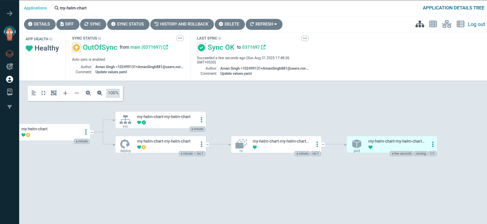

# 🚀 Deploying Application to Kubernetes using ArgoCD and AWS ECR

This guide explains how to deploy an application into a Kubernetes cluster using **ArgoCD** with Docker images stored in **Amazon ECR** and manifests hosted in a **GitHub repository**.

---

## ⚙️ Step 1: Create Namespace
Create a namespace in Kubernetes where the application will be deployed.

```bash
kubectl create namespace <namespace-name>
```

## ⚙️ Step 2: Authenticate with AWS ECR

Login to your ECR registry so that Docker (and later Kubernetes) can pull images.

```bash
aws ecr get-login-password --region <region> \
  | docker login --username AWS --password-stdin <123456789>.dkr.ecr.<region>.amazonaws.com
```

## ⚙️ Step 3: Create Kubernetes Secret for ECR

Create a Docker registry secret inside the same namespace where your app will run.

```bash
kubectl create secret generic regcred \
  --from-file=.dockerconfigjson=$HOME/.docker/config.json \
  --type=kubernetes.io/dockerconfigjson \
  --namespace <namespace-name>
```


Then, make sure your application deployment references this secret:

```yaml
spec:
  template:
    spec:
      imagePullSecrets:
        - name: regcred
```

## ⚙️ Step 4: Deploy Application with ArgoCD

Apply your ArgoCD application definition (argocd.yaml) to the cluster.

# ✅ Deployment Complete

Your application is now managed by ArgoCD. Any changes pushed to your GitHub repository will automatically sync to the Kubernetes cluster.


