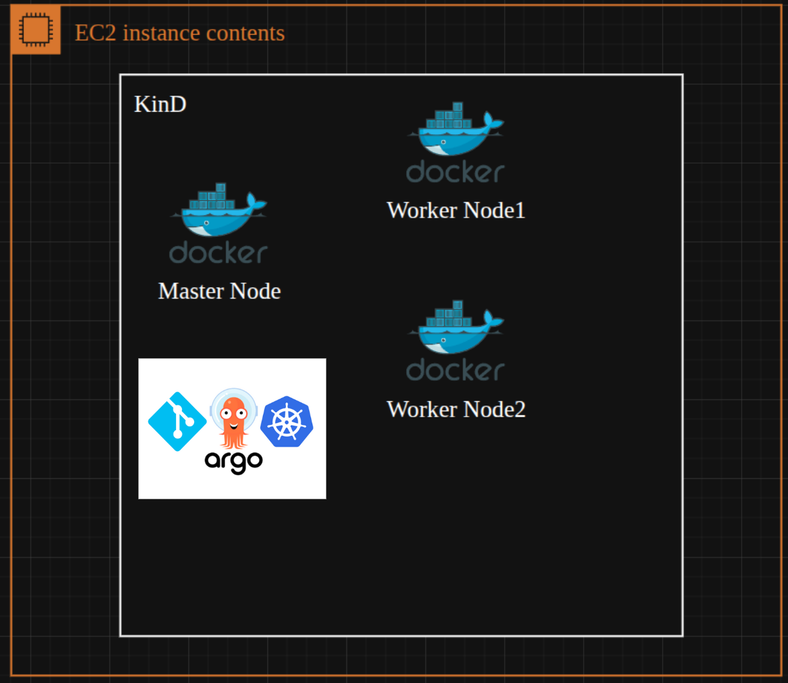

# GitOps Project with ArgoCD on KinD (Kubernetes-in-Docker) inside AWS EC2

This repository documents the setup of a **GitOps environment using ArgoCD** deployed on a **KinD (Kubernetes-in-Docker) cluster** running inside an **AWS EC2 instance**.  
The goal is to provide a reproducible way to deploy and manage applications declaratively using GitOps principles.

---



## 📋 Prerequisites

Before setting up the cluster and ArgoCD, ensure the following requirements are met on your EC2 instance:

1. **Docker installed**  
   Follow the official Docker installation guide: [Install Docker](https://docs.docker.com/engine/install/).

   After installation, add your user to the Docker group and reboot the instance:
   ```bash
   sudo usermod -aG docker $USER

2. **KinD installed**  
   Install KinD by following the: [Install KinD](https://kind.sigs.k8s.io/docs/user/quick-start/#installation).

   ```bash
    # For AMD64 / x86_64
    [ $(uname -m) = x86_64 ] && curl -Lo ./kind https://kind.sigs.k8s.io/dl/v0.30.0/kind-linux-amd64
    # For ARM64
    [ $(uname -m) = aarch64 ] && curl -Lo ./kind https://kind.sigs.k8s.io/dl/v0.30.0/kind-linux-arm64
    chmod +x ./kind
    sudo mv ./kind /usr/local/bin/kind

    #Verify installation:
    kind --version

3. **kubectl installed**  
   Install kubectl by following the official Kubernetes documentation: [Install Kubectl](https://kubernetes.io/docs/tasks/tools/install-kubectl-linux/).

   Verify installation:
   ```bash
   kubectl version --client


## 🚀 Creating the KinD Cluster

1. **Create a configuration file named config.yml for the KinD cluster:**

```yaml
kind: Cluster
apiVersion: kind.x-k8s.io/v1alpha4

nodes:
- role: control-plane
  image: kindest/node:v1.33.0
  extraPortMappings:
    # Map ArgoCD server service port (443 inside cluster) to EC2 host port 8443
    - containerPort: 30080 
      hostPort: 8443
      protocol: TCP

- role: worker
  image: kindest/node:v1.33.0

- role: worker
  image: kindest/node:v1.33.0

```

2. **Create the cluster and Verify cluster creation**

```bash
#Now create the cluster:
kind create cluster --config=config.yml --name=mycluster

#Verify cluster creation:
kubectl cluster-info --context kind-mycluster
```


## ⚙️ Installing ArgoCD

```bash
#Create the namespace for ArgoCD:
kubectl create namespace argocd

#Apply the official ArgoCD installation manifest:
kubectl apply -n argocd -f https://raw.githubusercontent.com/argoproj/argo-cd/stable/manifests/install.yaml

#Verify that all ArgoCD pods are running:
kubectl get pods -n argocd
```


## 🔗 Exposing the ArgoCD Server

By default, the `argocd-server` service is of type `ClusterIP`, which is not accessible externally.  
Change it to `NodePort`:

```bash
kubectl edit svc argocd-server -n argocd
```

Find the `spec.type` field and change its value from:

```yaml
type: ClusterIP
```

to:

```yaml
type: NodePort
```

Save and exit the editor.

You can now access the ArgoCD server on your EC2 instance public IP at the mapped port (e.g., `8443`).

Example:
```
https://<EC2_PUBLIC_IP>:8443
```

---

## 🔑 Getting the Initial Admin Password

To log in to the ArgoCD web UI, retrieve the default admin password:

```bash
kubectl -n argocd get secret argocd-initial-admin-secret \
  -o jsonpath="{.data.password}" | base64 -d; echo
```

- **Username:** `admin`  
- **Password:** `<output from above command>`
