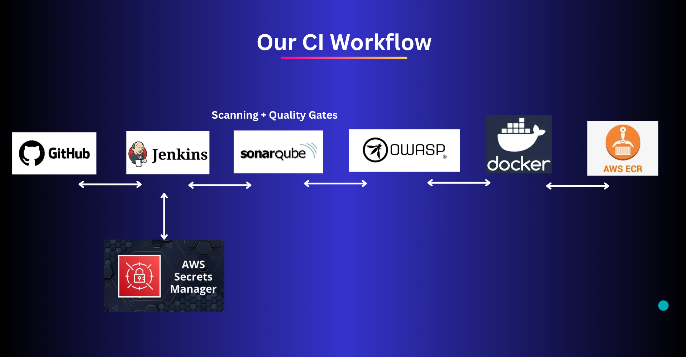
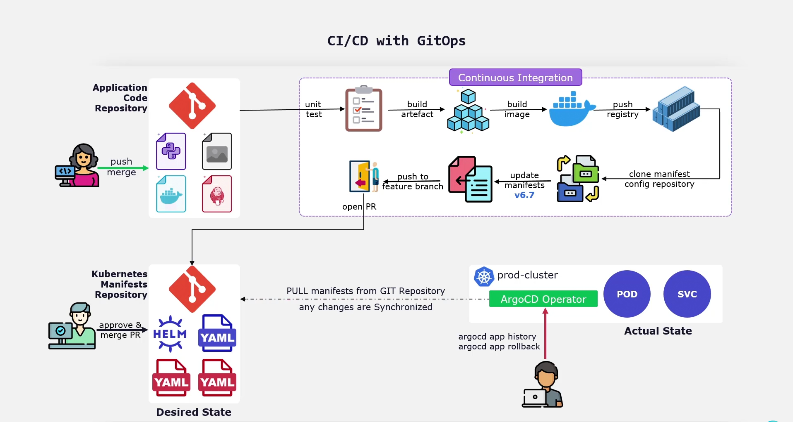

# 🚀 CI/CD with GitOps

This project demonstrates how to implement a **GitOps-driven CI/CD pipeline** where Continuous Integration (CI) prepares build artifacts and container images, and Continuous Delivery (CD) is achieved using **ArgoCD**.  

The workflow is built around the principle that **Git is the single source of truth** for both application code and Kubernetes manifests. ArgoCD continuously synchronizes the desired state (in Git) with the actual state (running in the Kubernetes cluster).

---

## 📋 Before You Begin
- If you want to know how to set up the environment (KinD cluster, ArgoCD installation, etc.), please refer to: **[`Prerequisit.md`](./Prerequisites.md)**

- If you want to understand the detailed CI pipeline (Jenkins, SonarQube, OWASP, Docker, AWS ECR), please refer to: **[`CI.md`](./CI.md)**.

- If you want to know how to set up the ArgoCD , please refer to: **[`ArgoCDsetup.md`](./ArgoCDsetup.md)** 

This file explains only the **workflow from CI to GitOps** as shown in the diagram below:

---

## 🔎 What is GitOps?

**GitOps** is a modern approach to Continuous Delivery that uses Git as the source of truth for declarative infrastructure and applications.  

In GitOps:  
- Application manifests (YAML, Helm, Kustomize, etc.) are stored in a **Kubernetes Manifests Repository**.  
- Any change to the application state must go through a **Git pull request (PR)**.  
- ArgoCD watches this repo and ensures the cluster is always synchronized with the latest approved state in Git.  
- Rollbacks are simple: revert the Git commit and ArgoCD will reconcile the cluster to the previous state.  

---

## 🔄 Workflow: From CI to GitOps

1. **Application Code Repository**  
   - Developers push or merge changes into the **Application Code Repository** (e.g., GitHub).  
   - The CI pipeline is triggered.  

2. **Continuous Integration**  
   - Code is built, tested, scanned (SonarQube, OWASP).  
   - A Docker image is built and pushed to the container registry (e.g., AWS ECR).  
   - The CI pipeline updates the **Kubernetes manifest repository** with the **new image tag**.  

3. **Pull Request (Transition to GitOps)**  
   - A pull request is created in the **Manifests Repository**.  
   - This PR contains only the manifest changes (e.g., updated Deployment YAML with a new image version).  
   - The PR is reviewed and approved by the team before merging.  

4. **Desired State Repository (Kubernetes Manifests)**  
   - Once the PR is merged, the manifests repository represents the **desired state** of the cluster.  
   - This repository contains only YAML/Helm configurations, separate from application source code.  

5. **ArgoCD Synchronization**  
   - ArgoCD continuously pulls from the Manifests Repository.  
   - When changes are detected (new image tag, config update, etc.), ArgoCD applies them to the cluster.  
   - The **actual state** of the cluster is reconciled with the **desired state** defined in Git.  

6. **Deployment in Cluster**  
   - Updated Pods and Services are created in the cluster automatically.  
   - ArgoCD provides a history of deployments and supports rollbacks if needed.  

---

## 🌿 Branching Strategy

To ensure controlled and auditable deployments, the following branching strategy can be adopted:

- **Feature Branches**  
  Developers open feature branches in the **Application Code Repository** to work on new features or bug fixes.  

- **Main Branch (Application Repository)**  
  - Merges into `main` trigger CI pipelines.  
  - Produces new container images and proposes manifest updates via PRs.  

- **Manifests Repository Branches**  
  - **`featureBranch` branch**: Used for development or staging environments.  
  - **`main` branch**: Represents the production environment’s desired state.  

- **Promotion via PRs**  
  - Deployments flow from `featureBranch` → `main` through PR approvals.  
  - This ensures human review before changes reach production.  

---

## 🔁 Rollbacks

- If a deployment introduces issues, rollbacks are simple:  
  - Revert the problematic commit in the **Manifests Repository**.  
  - ArgoCD detects the change and synchronizes the cluster back to the last good state.  

---

## ✅ Key Advantages of This Workflow

- **Separation of concerns**:  
  - Application repo → source code and CI.  
  - Manifests repo → deployment configuration and CD.  

- **Auditability**:  
  - Every deployment is a Git commit with full history and traceability.  

- **Security**:  
  - Only reviewed PRs can update cluster state.  

- **Reliability**:  
  - ArgoCD continuously monitors and heals drift between desired and actual state.  

- **Rollback Support**:  
  - Rollbacks are Git reverts, not manual interventions.  

---

## 📌 Summary

This project combines the power of **CI pipelines** with the reliability of **GitOps practices**.  
- Developers focus on writing code and committing changes.  
- CI ensures build, test, scan, and image packaging.  
- CD is fully automated via GitOps, with ArgoCD ensuring that the Kubernetes cluster always matches the manifests repository.  

With this workflow, deployments become:  
- Automated  
- Secure  
- Observable  
- Reproducible  
